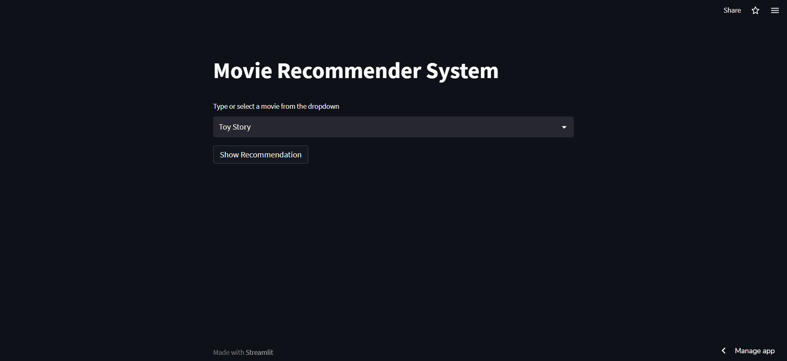
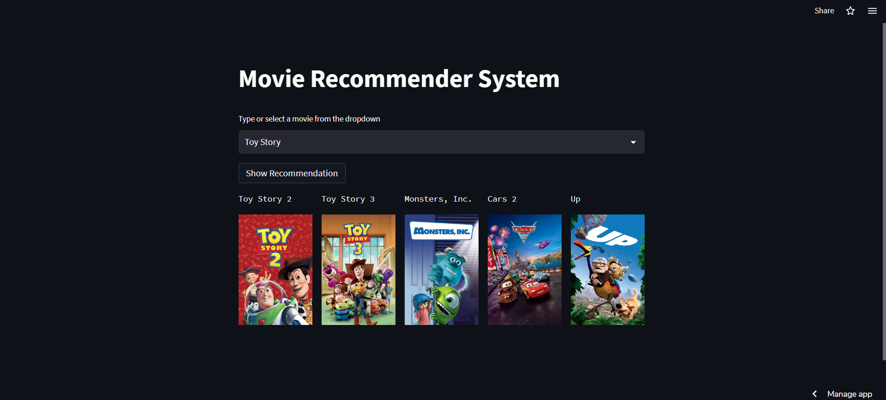

# Movie Recommendation System using Streamlit

Recommendation system that recommends movies similar to those the user likes based on content.

Check out the live demo: https://aditya-aryan123-streamlit-recommendationsystem-app-app-w4qqhu.streamlit.app/

## Screenshot of the project

## Overview

The movies are recommended based on the content of the movie you entered or selected. The main parameters that are considered for the recommendations are the genre, overview of the movie, top 10 casts, director, production companies, production countries, tagline, keywords and producer. The details of the movies, such as title, genre, runtime, rating, poster, casts, etc., are fetched from TMDB.

## How to get the API key?

Create an account in https://www.themoviedb.org/. Once you successfully created an account, click on the API link from the left hand sidebar in your account settings and fill all the details to apply for an API key. If you are asked for the website URL, just give "NA" if you don't have one. You will see the API key in your API sidebar once your request has been approved.

## How to run the project?

1. Clone or download this repository to your local machine.
2. Install all the libraries mentioned in the requirements.txt file with the command pip install -r requirements.txt
3. Get your API key from https://www.themoviedb.org/.
4. Replace YOUR_API_KEY in app.py file on line 22 and hit save.
5. Open your terminal/command prompt from your project directory and run the file app.py by executing the command streamlit app.py and it'll automatically open in your browser.

## TF-IDF Vectorizer:

TF-IDF stands for term frequency-inverse document frequency and it is a measure that can quantify the importance or relevance of string representations (words, phrases, lemmas, etc)  in a document amongst a collection of documents (also known as a corpus).

## How TF-IDF Vectorizer works?

Term frequency works by looking at the frequency of a particular term in a document. Inverse document frequency looks at how common (or uncommon) a word is amongst the corpus. IDF is calculated as follows where t is the term (word) we are looking to measure the commonness of and N is the number of documents (d) in the corpus (D).. The denominator is simply the number of documents in which the term, t, appears in. 

 

The reason we need IDF is to help correct for words like “of”, “as”, “the”, etc. since they appear frequently in an English corpus. Thus by taking inverse document frequency, we can minimize the weighting of frequent terms while making infrequent terms have a higher impact.

Finally IDFs can also be pulled from either a background corpus, which corrects for sampling bias, or the dataset being used in the experiment at hand.

## Similarity Score :

It is a common approach to match similar documents is based on counting the maximum number of common words between the documents.

## How Cosine Similarity works?

Cosine similarity is a metric used to determine how similar the documents are irrespective of their size.
Mathematically, Cosine similarity measures the cosine of the angle between two vectors projected in a multi-dimensional space.
In this context, the two vectors I am talking about are arrays containing the word counts of two documents.

